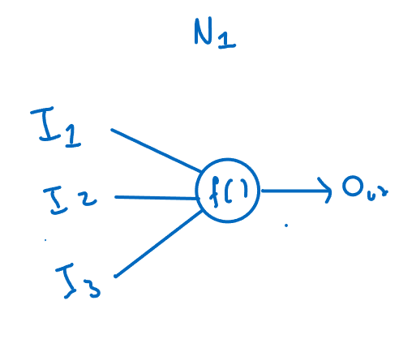
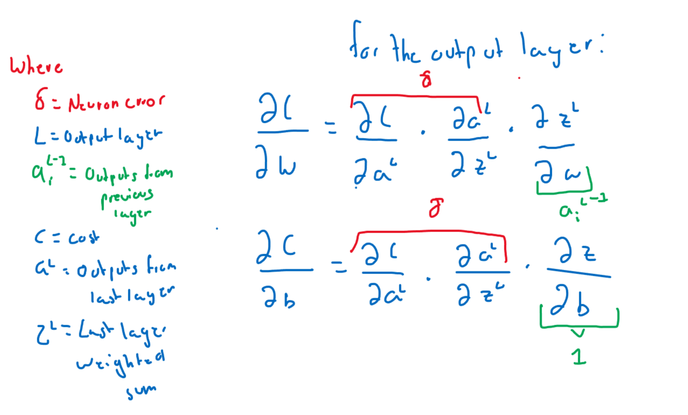

# AI

This project is an example of a neural network developed for 
recognizing digits. It is based primarily on the Neural Network
series made by 3blue1brown, so definitely go check it out.

The neural network consists on 2 hidden layers, made of 16 neurons
each, and 1 output layer made up of 10 neurons (This is because we
expect the answer to be one of the 10 digits). As of the input, I
used the dataset provided from the mnist, which I translate as a 
vector of 784 elements.

As a quick side note, if there is any concept that I may not
have explained so clearly, or a part of code that can be improved
please let me know, and I will kindly look into any suggestions.

### What is a neural network?
It is no secret that AI is a very popular word nowadays, however
it is very interesting to see how it works. We usually believe
that it is some kind of self learning skynet, or that it will 
revolutionize the world as we know it, and don't get me wrong,
it will, just not how you may think.

A neural network, besides learning, is designed to reduce a 
cost function, that indicates the network how well it is doing
at a given task. So first things first, what does a network do
with a given input? To answer this question I will first explain 
what does a single neuron do.

We can think of a neuron as a function that receives a certain input
and gives a certain output, for example:

Now, neurons work by assigning a weight to each of the inputs they receive, 
and a bias to the whole operation:

The result of this operation is known as the weighted sum, and at last
the neuron performs something called an activation function on this value,
giving out it's input. Some activation functions are the RELU, sigmoid,
tanh, etc...

After performing this operation the Neuron returns an output, this output
is referred as the neuron's activation, and is often between 0 and 1 because
of the activation function.

Now, this is just the work of one single neuron, for the network described
above we have 784 + 16 + 16 + 10 neurons, which would mean this operation
has to be performed 826 times, and each of the previous layers outputs become
an activation for the next layer so keeping up with the values can become 
complicated, and even slow.

This is where linear algebra becomes in really handy, as it allows to keep
track of the values using vectors and matrix, while performing the operations
incredibly fast using the Numpy library. So let's depict what the input layer
would look like:

Using matrix multiplication we can easily perform this operation without
having to worry about each neuron index, we just need to remember the weight
matrix and bias vector assigned to each layer. Now, as a quick disclaimer, the
way I use matrix multiplication in my code, and in the images above is not the
only way to achieve the result, playing with the matrix and vector dimensions 
you could achieve the same result, this is just the way that I decided to follow 
as it was the one shown by 3blue1brown.

Now as you may infer, a group of neurons is called a layer, and each layer's
output is defined by the previous layer's activation. Because of this, to
find what is the output of the neural network we need to follow the sequence
of outputs from the starting input to the output layer. This process is known
as forward propagation. 

I decided to code it by doing a Layer class, that holds the weight matrix, 
the bias vector, the previous layer activation (or the input itself, for the case
of the first hidden layer) and an output vector.
        
    def calculate(self, layer_input):
        self.input = layer_input
        self.weighted_sum = (self.weights @ layer_input) + self.biases
        self.output = sigmoid(self.weighted_sum)
    return self.output

This allows each layer to calculate it's input and return an output vector
which we can use to calculate the output of the layer in front of it, as
it becomes it's input:

    def foward_propagation(self, input_data):
        """" For the foward propagation we take the initial input
        and run it along the calculations of the first hidden layer,
        later these activations become the input of the next layer and
        so on."""

        layer_input = input_data
        for layer in self.layers:
            layer_input = layer.calculate(layer_input)
        return self.layers[-1].output

We now have a network that can give an output that represents each of
the ten digits, the higher the output, the more secure the network is of a
specific result. Because I choose to use the sigmoid function as the activation
function of the last layer, the result can be interpreted as a percentage.

This would make the highest value of the output layer the network's guess
for what the digit shown is. Now, the values of the weights and bias are 
initialized randomly, therefore we need to have a way of telling the 
network that it's guess is wrong.

This is known as the cost function. In our case, we want all the neurons
that are not the digit to be 0, and the expected digit to be 1 (representing
that it is 100% sure it is that number). So, to calculate the cost I used
the mean squared error, that is the sum of each (output - expected_value)^2.

Now we have a way of telling how wrong the network is, however, where do
we go from here?

### Backpropagation

The thing about neural networks is that there are a lot of factors 
responsible for an output, the weights in this network are about 13,000
so it is hard calculating how each one influences the cost.

Grant (3blue1brown) gives a pretty good analogy on the subject, think
about each weight and bias as if it were a knob. How would you turn each
knob to reduce the cost? To do this we would first need to know how the 
change of a weight influences the cost function. This is where diferential
calculus comes into play, namely partial equations, and chain rule.

To calculate this derivative, as it is a composite function we would need
to use the chain rule. I am not going to go into much detail as to where
the formulas come from because I believe there are resources that explain 
them a lot better than me (I will link them all below), nonetheless I am
going to go into detail on how to apply them, so the formula goes as follows:

Now, this how the formula looks, and I want you to look at a pretty important
detail:

The chain rule allows us to connect the cost to the weight through different
partial derivatives. This is handy because the output layer is connected directly,
however the hidden layers are not. So to cancel the terms we need to connect
each layer to the layers that come after it. This is where the concept
of backpropagation comes into place. The red sign means the error that is associated
with a neuron, and you see the derivative of the weight would be the layer
input times this error, while the bias derivative would be the error itself.

So remember I said that the way this works is that the chain rule allows us,
to cancel terms? Well, once you go into the hidden layers this would mean
the partial derivatives would stack one into another, yet the partial derivative
of the cost and the partial derivative of the activation would keep stacking which
is why we could rewrite the formulas as follows:

Now, I know what you may be thinking, it is a lot of notation, but what 
does it truly mean? Well, basically what you are doing is backpropagating
the error of the output layer to all the layers that come before, which
is a fancy way of saying we are reusing values that we already calculated,
instead of calculating each neuron from zero.

So in practice, the linear algebra notation would look like this for the
output layer:

The expected_output vector is basically calculated with the digit the mnist
gives for an image. So if the digit we are looking for is a 5, then it would
mean that 5 is a 1, so we could use a list of size 10, and use those index like 
this:

    expected_outputs = np.vstack([0] * self.output_layer.neurons)
    expected_outputs[expected_output] = 1

This would give us the expected_outputs vector. Now the whole operation is:
    
    self.output_layer.error = (2 * (self.output_layer.output - expected_outputs)) * sigmoid_prime(
    self.output_layer.output)

Now to calculate the rest of the derivatives we would use the error vector
and multiply it by the transpose of the inputs, giving us all the derivatives
of the weight and bias:

Before we keep going it is a good time to introduce the gradient. If we now
know how the change of all weights and biases in a layer affect the cost, we
can use this information to either increase the cost or diminish it. This set
of derivatives are called the gradient, and by going in the direction contrary
to the gradient we can arrive at a function local minimum or the global minimum.

Great, so we have the formula to calculate the gradient, and now it would look
like this in the code:

    self.output_layer.weight_gradient = self.output_layer.error @ self.output_layer.input.transpose()
    self.output_layer.bias_gradient = self.output_layer.error

As a quick side note, the @ symbol means matrix multiplication in numpy, you
may see this also as the dot or matmul function.

As of the hidden layers, backpropagation is practically the same. You multiply the next layer's error
by the weights and then multiply each result by the prime activation function. This will give the
bias gradient, and to calculate the weight gradient you need to multiply the neuron error by the transpose
of the inputs.

        for layer_index in range(2, len(self.layers)+1):
            layer = self.layers[-layer_index]
            errors = self.layers[-layer_index + 1].error
            weight = self.layers[-layer_index + 1].weights
            layer.error = np.vstack((np.hstack(errors) @ weight)) * sigmoid_prime(layer.output)
            layer.bias_gradient = layer.error
            layer.weight_gradient = layer.error @ layer.input.transpose()

Once you have that the formula for applying the gradient looks something like this:

Nonetheless, it is important to understand what is going on. Whenever you apply the gradient of an example
it is the example telling the network how to best recognize that single example. Because of this, it is
essential to calculate the average gradient across the training examples. 

This can become very slow if we take all the data at once, so what we can do is take "mini batches". Basically,
it means that we divide the data into small portions and feed the network with these examples. Then we apply the
gradient after each mini batch. The way I did it was this:

    def batch_training(self, data, labels):
        gradient = np.array([np.zeros(layer.weights.shape) for layer in self.layers], dtype=object)
        bias_gradient = np.array([np.zeros(layer.biases.shape) for layer in self.layers], dtype=object)
        for index, image in enumerate(data):
            self.asses(np.vstack(image), labels[index])
            gradient += self.get_gradients()
            bias_gradient += self.get_bias_gradients()
            self.reset_layers()
        for index, layer in enumerate(self.layers):
            layer.weights += -(1/len(data) * gradient[index])
            layer.biases += -(1/ len(data) * bias_gradient[index])

I tested the network using a learning rate of 1 / by the len(data). I choose the data batches to be size 10.

## How to use?

If you wish to test the network you could try the following:

    Neural_Network = Network([784,16,16,10])
    Neural_Network.train(Data.data, Data.outputs, 10)

This will set the weights, and then to asses an individual image you use:

    print(Neural_Network.foward_propagation(np.vstack(Data.data[index])))

Where index is the image you wish to see, now to see the output expected just print:

    Data.outputs[index]

To see how well the network is doing you can use:

    results = []
    for index, i in enumerate(Data.outputs):
        results.append(Neural_Network.foward_propagation(np.vstack(Data.data[index])).argmax() == i)
    print('Done')
    print(results.count(True)/len(results) * 100)    

It will take a while, but it will show you the percentage of digits it gets right.

